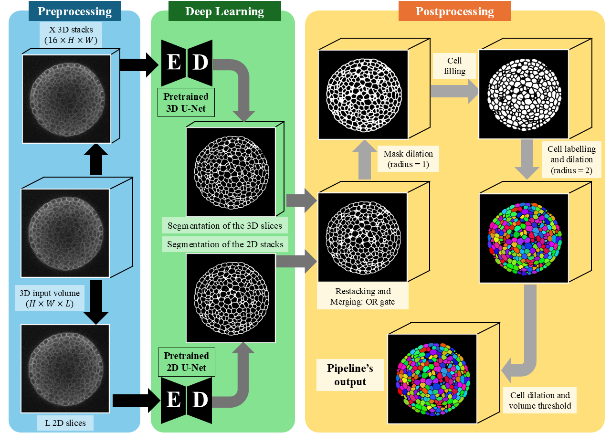

# Arabidopsis_DualDL
Segmentation of Arabidopsis Apical Stem Cells via a Dual Deep Learning Approach

## Overview

This repository implements a dual deep learning pipeline for automated segmentation of Arabidopsis apical stem cells using both 2D and 3D U-Net architectures. The approach combines the strengths of both models to achieve robust and accurate cell segmentation in confocal microscopy images.


*Figure: Dual deep learning pipeline workflow for Arabidopsis apical stem cell segmentation*

## Features

- **Dual Architecture Approach**: Utilizes both 2D and 3D U-Net models for comprehensive cell segmentation
- **Automated Pipeline**: Complete end-to-end processing from raw microscopy images to segmented cells
- **Configurable Parameters**: Easily adjustable processing parameters for different experimental conditions
- **Volume-based Filtering**: Intelligent filtering of segmented regions based on biological constraints
- **Metadata Integration**: Automatic pixel dimension extraction from image metadata

## Repository Structure

```
Arabidopsis_DualDL/
├── Main_pipeline.py          # Core segmentation pipeline implementation
├── Run_pipeline.py           # Configuration and execution script
├── 2D_UNet.pt               # Pre-trained 2D U-Net model weights
├── 3D_UNet.pt               # Pre-trained 3D U-Net model weights
└── README.md                # This file
```

## Requirements

The pipeline requires the following Python packages:

```python
torch
numpy
tifffile
scipy
scikit-image
```

## Installation

1. Clone this repository:
```bash
git clone https://github.com/yourusername/Arabidopsis_DualDL.git
cd Arabidopsis_DualDL
```

2. Install the required dependencies:
```bash
pip install torch numpy tifffile scipy scikit-image
```

3. Ensure you have the pre-trained model weights (`2D_UNet.pt` and `3D_UNet.pt`) in the repository directory.

## Usage

### Quick Start

1. **Configure the pipeline** by editing the configuration dictionary in `Run_pipeline.py`:

```python
config = {
    'model_paths': {
        '3d': r"path/to/3D_UNet.pt",
        '2d': r"path/to/2D_UNet.pt"
    },
    'input_images': [
        r"path/to/your/input/image.tif"
    ],
    'output_folders': {
        'segmentation': r"path/to/segmentation/output",
        'final': r"path/to/final/output"
    },
    'processing_params': {
        'stack_depth': 16,
        'cell_dilation_radius': 1,
        'cell_final_dilation_radius': 2,
        'volume_threshold_um3': 1.5
    },
    'pixel_dimensions': [0.5, 0.5, 1.0]  # [pix_x, pix_y, pix_z] in micrometers
}
```

2. **Run the pipeline**:
```bash
python Run_pipeline.py
```

### Configuration Parameters

- **model_paths**: Paths to the pre-trained 2D and 3D U-Net model files
- **input_images**: List of input TIFF image file paths to process
- **output_folders**: 
  - `segmentation`: Directory for intermediate segmentation results
  - `final`: Directory for final processed cell segmentations
- **processing_params**:
  - `stack_depth`: Depth of image stacks for running the 3D model
  - `cell_dilation_radius`: Initial dilation radius for cell boundaries # Advisable to use 1
  - `cell_final_dilation_radius`: Final dilation radius for cell boundaries # Advisable to use 2
  - `volume_threshold_um3`: Minimum cell volume threshold in cubic micrometers
- **pixel_dimensions**: Pixel size in micrometers [x, y, z]. Set to `None` to read from image metadata

### Advanced Usage

For custom implementations or integration into existing workflows, import the main pipeline class:

```python
from Main_pipeline import CellSegmentationPipeline

# Create and configure pipeline
pipeline = CellSegmentationPipeline(config)
pipeline.run_pipeline()
```

## Output

The pipeline generates two types of output:

1. **Segmentation Results**: Intermediate segmentation membrane masks stored in the specified segmentation folder
2. **Final Cell Segmentation**: Processed and filtered cell segmentations with applied morphological operations

## Model Information

This pipeline utilizes pre-trained U-Net models specifically designed for Arabidopsis apical stem cell segmentation:

### 2D U-Net Model
- **Source**: BioImage Model Zoo
- **Architecture**: 2D U-Net optimized for single-slice cell boundary detection
- **Application**: Precise boundary delineation in individual image slices

### 3D U-Net Model  
- **Source**: BioImage Model Zoo
- **Architecture**: 3D U-Net for volumetric cell segmentation
- **Application**: Spatial context preservation across image stacks

## Citation

If you use this pipeline in your research, please cite the following models:

```bibtex
@misc{wolny2023,
    author = {Wolny, Adrian and Cerrone, Lorenzo},
    title = {{2D UNet for Arabidopsis Apical Stem Cells}},
    year = {2022},
    publisher = {BioImage Model Zoo; Zenodo},
    doi = {zenodo.10022694}
}

@misc{wolny20233d,
    author = {Wolny, Adrian and Cerrone, Lorenzo},
    title = {{3D UNet Arabidopsis Apical Stem Cells}},
    year = {2022},
    publisher = {BioImage Model Zoo; Zenodo},
    doi = {10.5281/zenodo.7768142}
}
```

As well as the dataset:

```bibtex
@misc{willis2016repo,
  author       = {Willis, Lisa and Refahi, Yassin and Wightman, Ralf and Landrein, Baptiste and Teles, João and Huang, Ke and Meyerowitz, Elliot M and Jönsson, Henrik},
  title        = {Arabidopsis thaliana SAM confocal images and annotations},
  howpublished = {University of Cambridge Repository},
  year         = {2016},
  url          = {https://www.repository.cam.ac.uk/items/f7cdcf20-e8ca-4cf5-b7ab-90350a8d00b2},
}
```

## Contributing

Contributions are welcome! Please feel free to submit issues, feature requests, or pull requests to improve this pipeline.

## License

This project is licensed under the MIT License - see the LICENSE file for details.

## Acknowledgments

- The U-Net models were developed by Adrian Wolny and Lorenzo Cerrone and are available through the BioImage Model Zoo
- This work builds upon established deep learning architectures for bioimage analysis
- Special thanks to the open-source community for providing the foundational tools and libraries

## Contact

For questions, issues, or collaboration opportunities, please open an issue on this repository or contact the repository maintainer.

---

**Note**: Ensure that your input images are in TIFF format and that the pixel dimensions are correctly specified for accurate volume calculations and biological interpretation of results.
